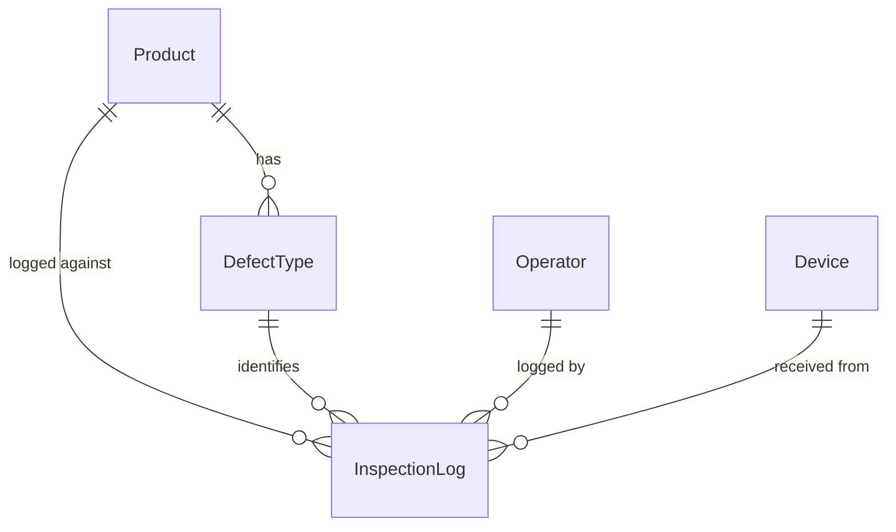

# Data Model

SQLite (WAL mode) on the server. Managed by SQLAlchemy 2.0 + Alembic.
See `docs/api-spec.md` for the REST surface and `docs/mqtt-topics.md`
for how this data reaches the STM32.

---

## Tables

| Table | Purpose |
|---|---|
| `products` | Products inspected at the plant |
| `defect_types` | Defect buttons scoped to a product and category |
| `inspection_logs` | Immutable log of every inspection tap (DEFECT or OK) |
| `operators` | Plant floor operators; login accounts via `user_id`, matricule = username (ADR-018) |
| `devices` | Known STM32 terminals (auto-registered on first heartbeat) |
| `users` | Dashboard accounts (QC responsable and admin) |
| `feature_flags` | Live-toggleable server-side flags |

`defect_categories` no longer exists as a table. The two categories
(`PMP`, `INJECTION`) are plant-wide constants defined in
`server/app/constants.py` and exposed via `GET /constants/categories`.
See ADR-013 in `docs/decisions.md`.

---

## Hard Rules

- **No hard deletes.** Set `active = 0` and `archived_at = <UTC timestamp>`.
  The one exception is `defect_logs`: logs are append-only and immutable.
- **12 defects per (product_id, category_kind) maximum.** Enforced
  server-side in `services.defect_types` before insert/update.
  Violation → HTTP 409. The `is_other_fallback` type does NOT count
  toward this cap.
- **Exactly one "Other" fallback per (product_id, category_kind).** Label
  fixed at `"Autre — préciser"`. Auto-created by `POST /products`.
  Cannot be archived from the UI.
- **Label ≤ 24 chars.** Enforced at the Pydantic schema layer. The
  firmware allocates a fixed 25-byte buffer per label.
- **UTC everywhere on the wire.** Timestamps stored as ISO 8601 strings
  (`YYYY-MM-DDTHH:MM:SSZ`). Display conversion to `Europe/Paris` is a
  dashboard concern only.
- **Every defect log carries product_id.** The device reports the product
  in the defect payload; the server validates the FK and stores it.

---

## Entity Relationships



---

## products

```sql
CREATE TABLE products (
    id          INTEGER PRIMARY KEY AUTOINCREMENT,
    name        TEXT    NOT NULL,
    reference   TEXT,               -- optional, e.g. "PROD-001" (migration 0008)
    client      TEXT,               -- optional, e.g. "Renault"  (migration 0008)
    cheatsheet  TEXT,               -- optional free-text inspection notes
    active      INTEGER NOT NULL DEFAULT 1,
    archived_at TEXT,
    created_at  TEXT    NOT NULL
                DEFAULT (strftime('%Y-%m-%dT%H:%M:%SZ', 'now'))
);

CREATE INDEX idx_products_active ON products (active);
```

**Column notes:**
- `name` — human-readable name shown in the dashboard (e.g. `"Capot moteur"`).
- `reference`, `client`, `cheatsheet` — the product "fiche" (migration 0008,
  ADR-019). All optional. The product list filters by `client` and suggests
  previously-used clients; `cheatsheet` is free-text inspection consignes.
- Creating a product via `POST /products` auto-creates two
  `defect_types` rows with `is_other_fallback=true`, one per
  `category_kind`. These seed the "Autre — préciser" fallback for each
  category.

**Example:**
```sql
INSERT INTO products (name, reference) VALUES
    ('Capot moteur', 'PROD-001');
```

---

## Category constants (not a table)

The two defect categories are a plant-wide enum, not a database table.
They are defined in `server/app/constants.py`:

```python
CATEGORY_KIND_PMP       = "PMP"
CATEGORY_KIND_INJECTION = "INJECTION"
CATEGORY_KIND_VALUES    = (CATEGORY_KIND_PMP, CATEGORY_KIND_INJECTION)
CATEGORY_DISPLAY_NAMES  = {
    CATEGORY_KIND_PMP:       "PMP Défauts",
    CATEGORY_KIND_INJECTION: "Injection Défauts",
}
```

`PMP` maps to defects in PMP's own paint work. `INJECTION` maps to
defects in upstream injection-moulded parts. This distinction is
plant-wide and fixed; it cannot be renamed or extended from the
dashboard (see ADR-013).

The dashboard fetches display names from `GET /constants/categories`.
Do not hardcode them in component source.

---

## defect_types

```sql
CREATE TABLE defect_types (
    id                INTEGER PRIMARY KEY AUTOINCREMENT,
    product_id        INTEGER NOT NULL REFERENCES products (id),
    category_kind     TEXT    NOT NULL
                      CHECK (category_kind IN ('PMP', 'INJECTION')),
    label             TEXT    NOT NULL,        -- max 24 chars
    is_other_fallback INTEGER NOT NULL DEFAULT 0,  -- 1 = "Autre — préciser"
    display_order     INTEGER NOT NULL DEFAULT 0,
    active            INTEGER NOT NULL DEFAULT 1,
    archived_at       TEXT,
    created_at        TEXT    NOT NULL
                      DEFAULT (strftime('%Y-%m-%dT%H:%M:%SZ', 'now')),
    updated_at        TEXT    NOT NULL
                      DEFAULT (strftime('%Y-%m-%dT%H:%M:%SZ', 'now'))
);

CREATE INDEX idx_defect_types_product ON defect_types (product_id, category_kind, active);
CREATE UNIQUE INDEX idx_defect_types_other
    ON defect_types (product_id, category_kind)
    WHERE is_other_fallback = 1;
```

**Column notes:**
- `product_id` — the product this defect type belongs to. A defect type
  has no meaning outside its product context.
- `category_kind` — `"PMP"` or `"INJECTION"`. Replaces the old
  `category_id` foreign key.
- `label` — rendered verbatim on the STM32 button. Max 24 chars;
  12–16 is comfortable for the 100×60 px slot.
- `is_other_fallback` — exactly one row per `(product_id, category_kind)`
  pair may have this set to `1`. Auto-created; never archivable from the
  UI. Label is always `"Autre — préciser"`.
- `display_order` — slot 0–11 within the category's 4×3 button grid.
  The fallback type uses `display_order=99` so it sorts last.

**Example:**
```sql
-- Auto-created when product 1 is created:
INSERT INTO defect_types (product_id, category_kind, label, is_other_fallback, display_order)
VALUES (1, 'PMP',       'Autre — préciser', 1, 99),
       (1, 'INJECTION', 'Autre — préciser', 1, 99);

-- User-created defect:
INSERT INTO defect_types (product_id, category_kind, label, display_order)
VALUES (1, 'PMP', 'Coulure', 0);
```

---

## inspection_logs

Introduced in ADR-014. Replaces `defect_logs`.

```sql
CREATE TABLE inspection_logs (
    id             INTEGER PRIMARY KEY AUTOINCREMENT,
    device_id      TEXT    NOT NULL REFERENCES devices (id),
    operator_id    INTEGER NOT NULL REFERENCES operators (id),
    product_id     INTEGER NOT NULL REFERENCES products (id),
    outcome        TEXT    NOT NULL DEFAULT 'DEFECT'
                   CHECK (outcome IN ('DEFECT', 'OK')),
    defect_type_id INTEGER REFERENCES defect_types (id),  -- NULL for OK
    note           TEXT,              -- max 140 chars; set only for
                                     -- is_other_fallback=1 DEFECTs
    logged_at      TEXT    NOT NULL, -- device clock time (ISO 8601 UTC)
    received_at    TEXT    NOT NULL
                   DEFAULT (strftime('%Y-%m-%dT%H:%M:%SZ', 'now')),
    CONSTRAINT ck_inspection_logs_defect_type_required_for_defect
        CHECK ((outcome = 'OK') OR (defect_type_id IS NOT NULL))
);

CREATE INDEX idx_inspection_logs_received_at  ON inspection_logs (received_at);
CREATE INDEX idx_inspection_logs_logged_at    ON inspection_logs (logged_at);
CREATE INDEX idx_inspection_logs_operator     ON inspection_logs (operator_id);
CREATE INDEX idx_inspection_logs_defect_type  ON inspection_logs (defect_type_id);
CREATE INDEX idx_inspection_logs_device       ON inspection_logs (device_id);
CREATE INDEX idx_inspection_logs_product      ON inspection_logs (product_id);
CREATE INDEX idx_inspection_logs_outcome      ON inspection_logs (outcome);
```

**Column notes:**
- `outcome` — `'DEFECT'` or `'OK'`. Required. Default is `'DEFECT'` for
  backward-compat with migrated rows.
- `defect_type_id` — nullable. NULL for OK inspections; required for DEFECT
  (enforced by the CHECK constraint).
- `product_id` — the product the operator was inspecting. Enables per-product
  Taux NC analytics.
- `note` — free-text annotation, max 140 chars. Only for `is_other_fallback`
  DEFECTs.
- `logged_at` — STM32 RTC time (UTC). Use for timeline display; use
  `received_at` for server-side aggregation.
- No `active`/`archived_at` — immutable append-only log.

**Example:**
```sql
-- DEFECT
INSERT INTO inspection_logs
    (device_id, operator_id, product_id, outcome, defect_type_id, note, logged_at)
VALUES ('qc-stm32-001a2b3c', 1, 1, 'DEFECT', 5, null, '2026-05-19T08:23:01Z');

-- OK (part passes)
INSERT INTO inspection_logs
    (device_id, operator_id, product_id, outcome, logged_at)
VALUES ('qc-stm32-001a2b3c', 1, 1, 'OK', '2026-05-19T08:25:00Z');
```

---

## operators

An operator **is a login account** (ADR-018): a `users` row with role
`operator`, linked 1:1 via `user_id`. The `matricule` is the login username
(ADR-018 amendment); attribution still lives in `operators` so
`inspection_logs` is untouched.

```sql
CREATE TABLE operators (
    id          INTEGER PRIMARY KEY AUTOINCREMENT,
    name        TEXT    NOT NULL,
    matricule   TEXT    UNIQUE,       -- login username; employee id (ADR-018/019)
    last_name   TEXT,                 -- HR details (migration 0009)
    phone       TEXT,
    address     TEXT,
    user_id     INTEGER UNIQUE        -- login account, role `operator` (ADR-018)
                REFERENCES users(id),
    pin_hash    TEXT,                 -- legacy MQTT only; retired from web (ADR-018)
    active      INTEGER NOT NULL DEFAULT 1,
    archived_at TEXT,                 -- ISO 8601 UTC, set on soft-delete
    created_at  TEXT    NOT NULL
                DEFAULT (strftime('%Y-%m-%dT%H:%M:%SZ', 'now'))
);

CREATE INDEX idx_operators_active        ON operators (active);
CREATE UNIQUE INDEX ix_operators_matricule ON operators (matricule);
```

**Column notes:**
- `matricule` — employee id entered by the responsable on create; doubles as
  the login username (`users.email`). Unique among operators; must match
  `^[A-Za-z0-9._-]+$`. A duplicate is rejected with HTTP 409.
- `user_id` — the `users` row (role `operator`) this operator signs in as.
  `NULL` for legacy operators until a password is regenerated for them.
- `pin_hash` — **retired** from the web flow (ADR-018). Kept nullable only for
  the historical MQTT operators config; new operators never set it.
- `name` / `last_name`, `phone`, `address` — display name and optional HR
  details shown in the dashboard.

**Example:**
```sql
-- Created via POST /operators {matricule, name, ...}; the login user is
-- created in the same transaction and the password returned once.
INSERT INTO operators (name, matricule, user_id) VALUES
    ('Mohammed', 'EMP-0427', 12);
```

---

## devices

```sql
CREATE TABLE devices (
    id               TEXT    PRIMARY KEY,  -- STM32 UID, e.g. qc-stm32-001a2b3c
    last_seen        TEXT,                 -- set on every status heartbeat
    config_version   INTEGER,              -- schema_version of last product config
    operator_version INTEGER,              -- schema_version of last operator list
    active           INTEGER NOT NULL DEFAULT 1,
    archived_at      TEXT,
    first_seen       TEXT    NOT NULL
                     DEFAULT (strftime('%Y-%m-%dT%H:%M:%SZ', 'now'))
);
```

**Column notes:**
- `id` — derived from the STM32's 96-bit unique ID, formatted as
  `qc-stm32-<lower8hexchars>`. Generated by the firmware; the server
  auto-inserts on first heartbeat receipt (upsert).
- `config_version` — tracks the `schema_version` of the last
  `qc/config/products` message the device acknowledged.
- A device is "online" if `last_seen` is within the last 90 seconds.

**Example:**
```sql
INSERT INTO devices (id, last_seen, config_version, operator_version)
VALUES ('qc-stm32-001a2b3c', '2026-05-19T08:23:00Z', 2, 1)
ON CONFLICT (id) DO UPDATE SET
    last_seen        = excluded.last_seen,
    config_version   = excluded.config_version,
    operator_version = excluded.operator_version;
```

---

## users

```sql
CREATE TABLE users (
    id            INTEGER PRIMARY KEY AUTOINCREMENT,
    email         TEXT    NOT NULL UNIQUE,
    password_hash TEXT    NOT NULL,   -- argon2 encoded string
    role          TEXT    NOT NULL DEFAULT 'admin',  -- only 'admin' in PoC
    active        INTEGER NOT NULL DEFAULT 1,
    archived_at   TEXT,
    created_at    TEXT    NOT NULL
                  DEFAULT (strftime('%Y-%m-%dT%H:%M:%SZ', 'now'))
);

CREATE INDEX idx_users_email ON users (email);
```

**Column notes:**
- `password_hash` — argon2id, stored as the full argon2 encoded string
  (includes algorithm, params, salt, and hash).
- `role` — reserved for future multi-role support. Only `'admin'` is
  meaningful in the PoC.

---

## feature_flags

```sql
CREATE TABLE feature_flags (
    id          INTEGER PRIMARY KEY AUTOINCREMENT,
    name        TEXT    NOT NULL UNIQUE,
    enabled     INTEGER NOT NULL DEFAULT 0,
    description TEXT,
    updated_at  TEXT    NOT NULL
                DEFAULT (strftime('%Y-%m-%dT%H:%M:%SZ', 'now'))
);
```

**Column notes:**
- Read by `app/feature_flags.py` and cached in memory for
  `FEATURE_FLAGS_REFRESH_SECS` (default 30 s).
- See `docs/feature-flags.md` for the full flag registry.

**Example:**
```sql
INSERT INTO feature_flags (name, enabled, description) VALUES
    ('new_analytics_view', 0, 'Experimental redesigned analytics page');
```

---

## Migration from old model

The `defect_categories` table is dropped; the two category names are
now plant-wide constants in `app/constants.py`. The `defect_types`
table is migrated: `category_id` is replaced by `category_kind`
(`'PMP'` | `'INJECTION'`) and a `product_id` FK is added;
`is_other_fallback` and `updated_at` columns are new. The old
`product_ref` free-text field on `defect_logs` is removed; every log
now carries a `product_id` FK and a nullable `note` column.

Because the existing seed logs referenced the old schema,
`defect_logs` is truncated and re-seeded alongside the new product
and defect-type fixtures. See `scripts/seed_dev.py` for the updated
seed data. Alembic revision:
`alembic/versions/*_adr013_product_scoped_model.py`.
